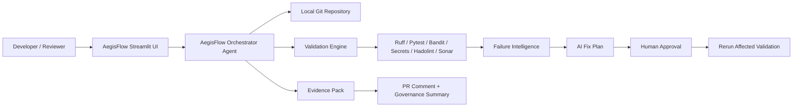

# 🛡️ AegisFlow: DevSecOps Pipeline Orchestrator Agent

> **Agentic DevSecOps cockpit for Azure Function repositories** — local repo inspection, PR validation readiness, CI/CD evidence, SonarQube quality gates, AI explanations, approved fix plans, and downloadable evidence packs.

<p align="center">
  
</p>

---

## 🎬 Demo & Live App

> Replace these placeholders with your deployed app/video links after publishing.

[](#)
[](#)
[](#)

- 🎥 **Video walkthrough:** _add YouTube link_
- 🚀 **Live interactive demo:** _add Streamlit/HuggingFace/Azure App link_
- 📦 **Latest release package:** _attach AegisFlow ZIP / release artifact_

---

## 📚 Wiki Navigation

### Architecture & Product Design

- 🏗️ [Architecture — AegisFlow DevSecOps Pipeline Orchestrator Agent](wiki/Architecture-AegisFlow-DevSecOps-Pipeline-Orchestrator-Agent.md)
- 📘 [Complete Technical Specification](wiki/Complete-Technical-Specification-AegisFlow.md)
- 🔁 [DevSecOps CI/CD Pipeline Mapping](wiki/DevSecOps-CICD-Pipeline-Mapping.md)
- 🤖 [Agentic Workflow and AI Fix Plan](wiki/Agentic-Workflow-and-AI-Fix-Plan.md)

### Functionality Reference

- 🧭 [Feature Reference](wiki/Feature-Reference.md)
- ✅ [Acceptance Criteria Mapping](wiki/Acceptance-Criteria-Mapping.md)
- 📦 [Evidence Pack and Reporting](wiki/Evidence-Pack-and-Reporting.md)
- 🔐 [Security and Governance](wiki/Security-and-Governance.md)

### Quick Links

- 📁 Source Code: `app.py`, `agent.py`, `templates/`, `docs/`
- 🧪 Validation: Ruff, Pytest, Bandit, detect-secrets, Hadolint, SonarScanner
- ☁️ Cloud: Azure DevOps, Azure Repos, Azure Function App, SonarQube/SonarCloud

---

## 🚀 About This Project

**AegisFlow** is a working MVP / product prototype for automating DevSecOps readiness of Python Azure Function repositories.

It takes a **local repository path**, understands the Git repo, checks whether the repo matches enterprise pipeline expectations, runs validations, creates missing DevSecOps files, explains failures, proposes safe fixes, and produces a review-ready evidence pack.

It is designed for teams that run many Azure DevOps pipelines and need a self-service way to answer:

- Is this repository structurally ready for the central pipeline template?
- Are unit tests, coverage, linting, and security checks passing?
- Is SonarQube configured and able to run?
- What exactly failed, why did it fail, and who should fix it?
- Can an approved patch be safely applied and revalidated?
- Is the PR ready for human review and merge?

---

## ✨ Key Capabilities

| Capability | What AegisFlow Does |
|---|---|
| **Repo Preflight** | Detects Git root, branch, remote origin, provider, changed files, project type, source/test/config inventory. |
| **Acceptance Criteria Cockpit** | Converts user-story checklist into pass/fail/partial/manual status. |
| **DevSecOps File Generation** | Generates or validates `azure-pipelines.yml`, `azure-function.config.yml`, `sonar-project.properties`, `pytest.ini`, `.coveragerc`, `.gitignore`, and `requirements-dev.txt`. |
| **Quality Gates** | Runs Python compile, Ruff format, Ruff lint, Hadolint Dockerfile lint, and code-quality checks. |
| **Security Gates** | Runs lightweight secret scan, `detect-secrets`, and Bandit static security analysis. |
| **Unit Testing & Coverage** | Runs Pytest with `coverage.xml` and `test-results.xml`; shows Azure DevOps-style coverage cards. |
| **SonarQube/SonarCloud** | Runs scanner when `SONAR_HOST_URL` and `SONAR_TOKEN` are provided; supports quality-gate wait. |
| **Evidence Pack** | Creates downloadable ZIP containing Markdown, JSON, coverage XML, test XML, logs, Sonar output, and pipeline evidence. |
| **AI Error Intelligence** | Explains failures, severity, probable owner, and common fixes. |
| **AI Fix Plan** | Shows exact diffs first, waits for approval, applies safe patches, and reruns affected validation. |
| **Aegis Chat** | Lets users ask questions about the current run, failures, PR readiness, and fixes. |
| **Git Automation** | Can create/switch branch, commit, push, and prepare PR only after repository confirmation and safety checks. |
| **Governance Decision Support** | Shows `ready`, `conditional_review`, or `blocked` without falsely approving production/security/compliance. |

---

## 🏗️ Architecture Overview

<p align="center">
  
</p>

AegisFlow is intentionally **local-first** and **human-in-the-loop**:



---

## 🧩 Dashboard Modules

AegisFlow provides the following dashboard tabs:

1. **Repo Preflight** — repository identity, branch, remote, changed files, file inventory.
2. **Acceptance Criteria** — task checklist mapped to pass/fail/manual/cloud-only status.
3. **Live Progress** — CI/CD execution timeline with heartbeat updates for long-running tasks.
4. **Report & Downloads** — evidence pack, coverage cards, test summary, report previews.
5. **AI Error Intelligence** — failure explanation, severity, owner, and suggested fixes.
6. **AI Fix Plan** — review exact diffs, approve patch, apply, and rerun validation.
7. **Aegis Chat** — ask questions about failures, PR readiness, Sonar, tests, Dockerfile, or evidence.
8. **SonarQube** — scan status, skipped reason, quality-gate status, and scanner logs.
9. **Governance** — release decision support and sign-off boundaries.
10. **PR Comment** — copyable PR validation summary.
11. **Industry Use Cases** — how the product applies across teams and sectors.

---

## 📦 Evidence Output

After a run, AegisFlow produces an evidence folder inside the target repo:

```text
orchestrator_reports/
  devsecops_orchestration_report_<timestamp>.md
  devsecops_orchestration_report_<timestamp>.json
  aegisflow_evidence_pack_<timestamp>.zip
  coverage.xml
  test-results.xml
  sonar-scanner-output.txt
```

The dashboard also previews:

- Azure DevOps-style code coverage cards
- test pass/fail counts
- validation event table
- Markdown evidence report
- JSON evidence report
- raw `coverage.xml`
- raw `test-results.xml`
- Sonar output when configured

---

## 🔐 Safety Model

AegisFlow is agentic, but controlled.

It can automatically fix safe issues such as formatting, linting, dependency installation, generated-test cleanup, and deterministic config updates. It does **not** silently change risky files.

| Area | Behavior |
|---|---|
| Business logic | Review-only unless user approves exact diff. |
| Secrets | Never generated or committed; recommends Key Vault / secure variables. |
| Production deployment | Decision support only; final approval remains human-owned. |
| Architecture/compliance | Evidence generation only; sign-off remains with responsible owner. |
| Git push / PR | Blocked until repo identity is confirmed and safety gate passes. |

---

## 🧪 Quick Start

### 1. Create / activate environment

```bash
conda create -n aegisflow python=3.11 -y
conda activate aegisflow
pip install -r requirements.txt
```

### 2. Run dashboard

```bash
python -m streamlit run app.py
```

### 3. Paste WSL repo path

```text
/mnt/c/Users/AnubhaAnubha/OneDrive - Pearce Services, LLC/onedrive_ubuntu/project/gis-key-detection-func
```

### 4. Prefetch repo details

Click **Prefetch repo details**, confirm the Git repository, then click **Run orchestrator**.

---

## 🔎 SonarQube Setup

AegisFlow can run SonarQube/SonarCloud if the following are configured:

```bash
export SONAR_HOST_URL="https://your-sonarqube-server"
export SONAR_TOKEN="your-token"
export SONAR_PROJECT_KEY="gis-key-detection-func"
```

Without these values, AegisFlow still generates `coverage.xml` and shows coverage locally, but Sonar upload and quality-gate checks are marked as skipped.

---

## ✅ Acceptance Criteria Coverage

AegisFlow explicitly checks the user-story acceptance criteria:

- delete unwanted files
- restructure `src/`, `tests/`, `src/conf/`
- update import paths
- check `parameters.yaml`
- split production/dev requirements
- update `.gitignore`
- add pipeline/config/Sonar files
- verify locally with dependencies, Ruff, Pytest, and coverage
- mark cloud-only items honestly, such as Azure branch policies, Azure Function deployment, health checks, rollback, and Sonar server validation

---

## 🧭 Current Status

| Capability | Status |
|---|---|
| Local repo inspection | ✅ Implemented |
| Acceptance criteria dashboard | ✅ Implemented |
| Azure DevOps-style coverage view | ✅ Implemented |
| Evidence ZIP + dashboard preview | ✅ Implemented |
| SonarQube scan support | ✅ Implemented when credentials are present |
| AI error explanation | ✅ Implemented |
| AI fix plan with approval | ✅ Implemented |
| Aegis Chat | ✅ Implemented |
| Git branch/commit/push support | ✅ Implemented with safety confirmation |
| Azure DevOps PR creation | ⚠️ Requires Azure DevOps PAT/config |
| Production deployment validation | ⚠️ Requires Azure credentials and deployed endpoint |
| Auto rollback | 🚧 Roadmap / pipeline-level implementation |

---

## 🏭 Industry Use Cases

- Azure Function DevSecOps onboarding
- PR validation readiness
- CI/CD quality-gate cockpit
- AI/ML API deployment validation
- MLOps model-serving repo validation
- security evidence generation
- compliance/audit evidence packs
- multi-team pipeline troubleshooting
- developer self-service DevOps
- release readiness decision support

---

## 🛠️ Built With

Python · Streamlit · Azure DevOps · Azure Functions · Pytest · Ruff · Bandit · detect-secrets · Hadolint · SonarQube/SonarCloud · Ollama · Graphviz · Git

Maintained by **@dranubhaparashar**

---

## 📄 License

Add your license here, for example: MIT / Apache-2.0 / Internal Enterprise Use.
