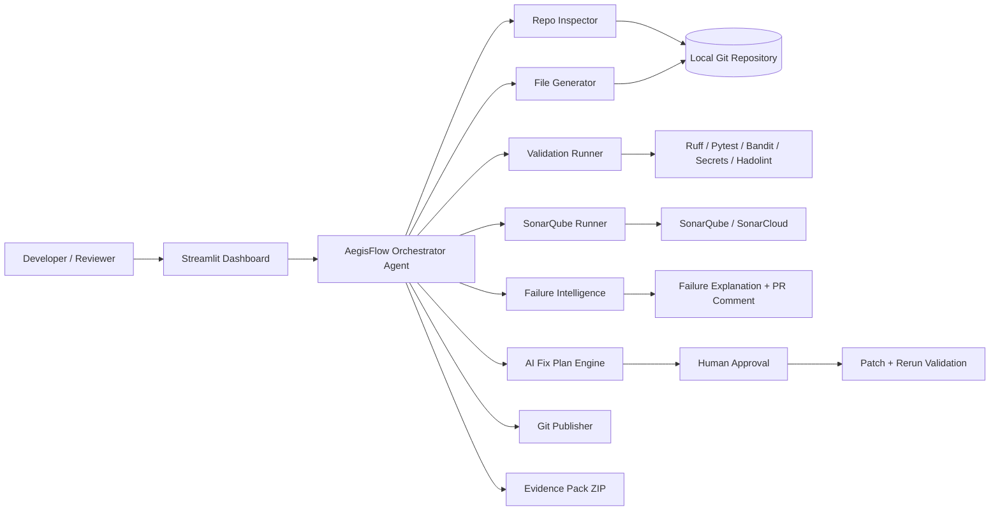
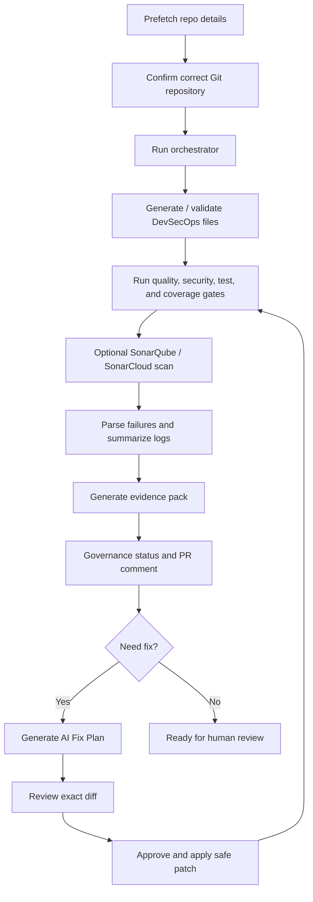

# 🛡️ AegisFlow: DevSecOps Pipeline Orchestrator Agent

> **Agentic DevSecOps cockpit for Azure Function and Python API repositories** — local repo inspection, PR validation readiness, CI/CD evidence, SonarQube quality gates, AI explanations, approved fix plans, Git automation, and downloadable evidence packs.
>
> 


---

## 🎬 Demo & Live App

[](https://youtu.be/l_R8OV8VF8g)
[](https://huggingface.co/spaces/AnubhaParashar/AegisFlow-DevSecOps-Pipeline-Orchestrator-Agent)
[](https://github.com/dranubhaparashar/AegisFlow-DevSecOps-Pipeline-Orchestrator-Agent/releases)

- 🎥 **Video walkthrough:** [Watch AegisFlow demo on YouTube](https://youtu.be/l_R8OV8VF8g)
- 🚀 **Live interactive demo:** [Try AegisFlow on Hugging Face Spaces](https://huggingface.co/spaces/AnubhaParashar/AegisFlow-DevSecOps-Pipeline-Orchestrator-Agent)
- 📦 **Latest release package:** [Download from GitHub Releases](https://github.com/dranubhaparashar/AegisFlow-DevSecOps-Pipeline-Orchestrator-Agent/releases)

> **Hosted Space note:** The Hugging Face Space is useful for demonstrating the AegisFlow UI. Full local-repository validation, Git automation, private repo access, Hadolint, SonarScanner, and Ollama workflows work best when AegisFlow is run locally or inside WSL because the hosted Space cannot access your private machine paths.

---

## 📚 Wiki Navigation

### Architecture & Product Design

- 🏠 [Wiki Home](https://github.com/dranubhaparashar/AegisFlow-DevSecOps-Pipeline-Orchestrator-Agent/wiki)
- 🏗️ [Architecture — AegisFlow DevSecOps Pipeline Orchestrator Agent](https://github.com/dranubhaparashar/AegisFlow-DevSecOps-Pipeline-Orchestrator-Agent/wiki/Architecture-AegisFlow-DevSecOps-Pipeline-Orchestrator-Agent)
- 📘 [Complete Technical Specification](https://github.com/dranubhaparashar/AegisFlow-DevSecOps-Pipeline-Orchestrator-Agent/wiki/Complete-Technical-Specification-AegisFlow)
- 🔁 [DevSecOps CI/CD Pipeline Mapping](https://github.com/dranubhaparashar/AegisFlow-DevSecOps-Pipeline-Orchestrator-Agent/wiki/DevSecOps-CICD-Pipeline-Mapping)
- 🤖 [Agentic Workflow and AI Fix Plan](https://github.com/dranubhaparashar/AegisFlow-DevSecOps-Pipeline-Orchestrator-Agent/wiki/Agentic-Workflow-and-AI-Fix-Plan)

### Functionality Reference

- 🧭 [Feature Reference](https://github.com/dranubhaparashar/AegisFlow-DevSecOps-Pipeline-Orchestrator-Agent/wiki/Feature-Reference)
- ✅ [Acceptance Criteria Mapping](https://github.com/dranubhaparashar/AegisFlow-DevSecOps-Pipeline-Orchestrator-Agent/wiki/Acceptance-Criteria-Mapping)
- 📦 [Evidence Pack and Reporting](https://github.com/dranubhaparashar/AegisFlow-DevSecOps-Pipeline-Orchestrator-Agent/wiki/Evidence-Pack-and-Reporting)
- 🔐 [Security and Governance](https://github.com/dranubhaparashar/AegisFlow-DevSecOps-Pipeline-Orchestrator-Agent/wiki/Security-and-Governance)

### Quick Links

- 📁 [Source Code](https://github.com/dranubhaparashar/AegisFlow-DevSecOps-Pipeline-Orchestrator-Agent)
- 🚀 [Live Hugging Face App](https://huggingface.co/spaces/AnubhaParashar/AegisFlow-DevSecOps-Pipeline-Orchestrator-Agent)
- 🎥 [YouTube Demo](https://youtu.be/l_R8OV8VF8g)
- 📦 [GitHub Releases / Evidence Pack](https://github.com/dranubhaparashar/AegisFlow-DevSecOps-Pipeline-Orchestrator-Agent/releases)
- 🐞 [Issues](https://github.com/dranubhaparashar/AegisFlow-DevSecOps-Pipeline-Orchestrator-Agent/issues)
- 🔀 [Pull Requests](https://github.com/dranubhaparashar/AegisFlow-DevSecOps-Pipeline-Orchestrator-Agent/pulls)

---

## 🚀 About This Project

**AegisFlow** is a working MVP/product prototype for automating DevSecOps readiness of Python Azure Function repositories, Python APIs, and similar CI/CD-enabled codebases.

It takes a **local repository path**, detects the Git root, understands the project structure, checks whether the repo matches enterprise pipeline expectations, runs validations, creates or verifies DevSecOps files, explains failures, proposes safe fix plans, and generates a review-ready evidence pack.

AegisFlow helps teams answer:

- Is this repository structurally ready for the central Azure DevOps pipeline template?
- Are unit tests, coverage, formatting, linting, security, and SonarQube checks passing?
- What exactly failed, why did it fail, and who should fix it?
- Can an approved patch be safely applied and revalidated?
- Is the pull request ready for human review and merge?
- Is the release ready, conditionally reviewable, or blocked?

---

## ✨ Key Capabilities

| Capability | What AegisFlow Does |
|---|---|
| **Repo Preflight** | Detects Git root, branch, remote origin, provider, changed files, project type, source/test/config inventory. |
| **Acceptance Criteria Cockpit** | Maps a DevSecOps user-story checklist into pass/fail/partial/manual/cloud-only status. |
| **DevSecOps File Generation** | Generates or validates `azure-pipeline.yml`, `azure-function.config.yml`, `sonar-project.properties`, `pytest.ini`, `.coveragerc`, `.gitignore`, and `requirements-dev.txt`. |
| **Quality Gates** | Runs Python compile checks, Ruff format, Ruff lint, Hadolint Dockerfile lint, and general code-quality checks. |
| **Security Gates** | Runs lightweight secret scanning, `detect-secrets`, and Bandit static security analysis. |
| **Unit Testing & Coverage** | Runs Pytest with `coverage.xml` and `test-results.xml`; renders Azure DevOps-style coverage cards directly in the dashboard. |
| **SonarQube/SonarCloud** | Runs scanner when `SONAR_HOST_URL` and `SONAR_TOKEN` are configured; supports quality-gate wait and includes scanner output in evidence. |
| **Evidence Pack** | Creates downloadable ZIP containing Markdown report, JSON report, coverage XML, test XML, logs, Sonar output, and selected config files. |
| **AI Error Intelligence** | Explains failures, severity, probable owner, and common fixes. |
| **AI Fix Plan** | Shows exact diffs first, waits for approval, applies safe deterministic patches, and reruns affected validation. |
| **Aegis Chat** | Lets users ask questions about the current run, failures, PR readiness, Sonar, tests, Dockerfile, or evidence. |
| **Git Automation** | Can create/switch branch, commit, push, and prepare PR only after repository confirmation and safety checks. |
| **Governance Decision Support** | Reports `ready`, `conditional_review`, or `blocked` without falsely approving production/security/compliance. |

---

## 🏗️ Architecture Overview

This README uses Mermaid diagrams instead of external PNG files, so the architecture does not break if `docs/assets/*.png` files are missing.





---

## 🧩 Dashboard Modules

AegisFlow v30 provides the following Streamlit dashboard tabs:

1. **Repo Preflight** — repository identity, branch, remote, changed files, and file inventory.
2. **Acceptance Criteria** — checklist mapped to pass/fail/manual/cloud-only status.
3. **Live Progress** — CI/CD execution timeline with heartbeat updates for long-running tasks.
4. **Report & Downloads** — evidence ZIP, Markdown/JSON reports, coverage cards, test summary, and previews.
5. **AI Error Intelligence** — failure explanation, severity, owner, and suggested fixes.
6. **AI Fix Plan** — review exact diffs, approve patch, apply, and rerun validation.
7. **Aegis Chat** — ask questions about the latest run and evidence.
8. **SonarQube** — scan status, skipped reason, quality-gate status, and scanner logs.
9. **Governance** — release decision support and sign-off boundaries.
10. **PR Comment** — copyable pull request validation summary.
11. **Industry Use Cases** — enterprise use cases across DevOps, security, MLOps, and compliance.

---

## 📦 Repository Structure

The uploaded v30 package contains the following main files and folders:

```text
AegisFlow-DevSecOps-Pipeline-Orchestrator-Agent/
├── app.py                                  # Streamlit dashboard UI
├── agent.py                                # Core orchestration, validation, AI, Git, evidence logic
├── azure_devops_client.py                  # Azure DevOps client placeholder/helper
├── requirements.txt                        # Python runtime dependencies
├── .env.example                            # Azure DevOps + Ollama environment variables
├── .streamlit/
│   └── config.toml                         # Streamlit configuration
├── templates/
│   ├── azure-pipeline-python-function.yml  # Azure Function pipeline template
│   ├── azure-pipeline-python-api.yml       # Python API pipeline template
│   ├── azure-pipeline-node.yml             # Node pipeline template
│   └── sonar-project.properties            # Sonar project template
├── docs/
│   ├── use_cases.md
│   ├── agentic_design.md
│   ├── governance_and_ai_extensions.md
│   ├── roadmap.md
│   ├── key_detection_devsecops_reference_summary.md
│   └── v*_*.md                             # Version-specific feature notes
└── reports/                                # Optional local output location
```

---

## 📦 Evidence Output

After a run, AegisFlow produces an evidence folder inside the target repo:

```text
orchestrator_reports/
  devsecops_orchestration_report_<timestamp>.md
  devsecops_orchestration_report_<timestamp>.json
  aegisflow_evidence_pack_<timestamp>.zip
  coverage.xml
  test-results.xml
  sonar-scanner-output.txt
```

The dashboard previews:

- Azure DevOps-style coverage cards
- line, branch, and method coverage summaries
- per-file coverage progress bars
- test pass/fail counts
- validation result table
- Markdown evidence report
- JSON evidence report
- raw `coverage.xml`
- raw `test-results.xml`
- Sonar output when configured

---

## 🔐 Safety Model

AegisFlow is agentic, but controlled.

It can automatically fix safe issues such as formatting, linting, generated-test cleanup, deterministic Dockerfile improvements, and deterministic config updates. It does **not** silently change risky files.

| Area | Behavior |
|---|---|
| Business logic | Review-only unless the user approves the exact diff. |
| Secrets | Never generated or committed; recommends secure variables or Key Vault. |
| Production deployment | Decision support only; final approval remains human-owned. |
| Architecture/compliance | Evidence generation only; sign-off remains with responsible owner. |
| Git push / PR | Blocked until repo identity is confirmed and safety gate passes. |
| Generated folders | `.aegisflow_backups/` and `orchestrator_reports/` are protected from recursive scanning, patching, and commits. |

---

## 🧪 Quick Start

### 1. Create and activate environment

```bash
conda create -n aegisflow python=3.11 -y
conda activate aegisflow
python -m pip install --upgrade pip
pip install -r requirements.txt
```

### 2. Run dashboard

```bash
python -m streamlit run app.py
```

### 3. Paste local/WSL repo path

Example WSL path:

```text
/mnt/c/Users/AnubhaAnubha/OneDrive - Pearce Services, LLC/onedrive_ubuntu/project/gis-key-detection-func
```

### 4. Prefetch and confirm repo

Click **Prefetch repo details**, verify the Git root/branch/remote, check the repository confirmation box, then click **Run orchestrator**.

---

## ⚙️ Environment Variables

Copy `.env.example` or export the variables manually.

### Azure DevOps PR creation

```bash
export AZDO_ORG_URL="https://dev.azure.com/YOUR_ORG"
export AZDO_PROJECT="YOUR_PROJECT"
export AZDO_REPO_ID="YOUR_REPO_ID_OR_NAME"
export AZDO_PAT="YOUR_PERSONAL_ACCESS_TOKEN"
```

### Optional local LLM / Ollama

```bash
export OLLAMA_HOST="http://localhost:11434"
export OLLAMA_MODEL="qwen2.5-coder:7b"
```

### Optional SonarQube / SonarCloud

```bash
export SONAR_HOST_URL="https://your-sonarqube-server"
export SONAR_TOKEN="your-token"
export SONAR_PROJECT_KEY="your-project-key"
```

Without Sonar variables, AegisFlow still generates local coverage evidence and marks Sonar upload/quality gate as skipped with a clear reason.

---

## 🔎 Validation Tools

AegisFlow can run or orchestrate the following checks depending on repo type and available tools:

| Tool / Check | Purpose |
|---|---|
| `git` | Repo root, branch, remote, changed files, safe Git automation. |
| Python compile | Detect syntax/import-level issues. |
| Ruff format/lint | Formatting and linting quality gate. |
| Pytest | Unit tests and XML test output. |
| Coverage | `coverage.xml` for dashboard and Sonar. |
| Bandit | Python static security analysis. |
| detect-secrets | Secret scanning. |
| Lightweight secret scanner | Fast local secret-pattern detection. |
| Hadolint | Dockerfile best-practice linting. |
| SonarScanner | SonarQube/SonarCloud analysis and quality-gate evidence. |
| Ollama | Optional local AI explanations and chat. |

---

## ✅ Acceptance Criteria Coverage

AegisFlow explicitly checks DevSecOps restructuring and readiness criteria such as:

- clean root folder
- `src/`, `tests/`, and `src/conf/` structure
- Azure Function files
- import path and configuration checks
- production/dev requirements split
- `.gitignore` expectations
- `azure-pipeline.yml` / `azure-function.config.yml` / `sonar-project.properties`
- dependency install readiness
- Ruff formatting and linting
- Pytest and coverage evidence
- SonarQube readiness
- cloud-only/manual items such as Azure branch policies, deployed endpoint checks, rollback, and production sign-off

---

## 🧭 Current Status

| Capability | Status |
|---|---|
| Local repo inspection | ✅ Implemented |
| Acceptance criteria dashboard | ✅ Implemented |
| Azure DevOps-style coverage view | ✅ Implemented in v30 |
| Persistent tab results/downloads | ✅ Implemented |
| Evidence ZIP + dashboard preview | ✅ Implemented |
| SonarQube/SonarCloud scan support | ✅ Implemented when credentials are present |
| AI error explanation | ✅ Implemented |
| AI fix plan with approval | ✅ Implemented |
| Aegis Chat | ✅ Implemented |
| Git branch/commit/push support | ✅ Implemented with safety confirmation |
| Azure DevOps PR creation | ⚠️ Requires Azure DevOps PAT/config |
| Production deployment validation | ⚠️ Requires Azure credentials and deployed endpoint |
| Auto rollback | 🚧 Roadmap / pipeline-level implementation |

---

## 🏭 Industry Use Cases

- Azure Function DevSecOps onboarding
- PR validation readiness
- CI/CD quality-gate cockpit
- AI/ML API deployment validation
- MLOps model-serving repo validation
- security evidence generation
- compliance/audit evidence packs
- multi-team pipeline troubleshooting
- developer self-service DevOps
- release readiness decision support
- standardized enterprise pipeline templates

---

## 🛠️ Built With

Python · Streamlit · Azure DevOps · Azure Functions · Pytest · Ruff · Bandit · detect-secrets · Hadolint · SonarQube/SonarCloud · Ollama · Git

---

## 👩‍💻 Maintainer

Maintained by **[@dranubhaparashar](https://github.com/dranubhaparashar)**

---

## 📄 License

**Internal Enterprise Use**.
